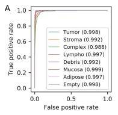
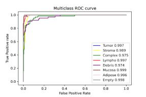
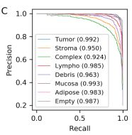

# Can you classify histopathological data at home? Reproducing the ARA-CNN model's data and performance.

*Authors: Jan Gąska, Jakub Lis, Wojciech Szczypek*  

## Abstract

The idea of reproducibility of scientific researches is crucial especially in the area of data science. It has become more important along with the development of methods and algorithms used in machine learning as they are more and more complex and complicated. This issue concerns users of all types: students, scientists, developers. Moreover, attaching code used in a paper helps readers to focus on the real content rather than sophisticated explanations and descriptions included in the article. It is also valuable because the users can use the code as examples of using the package. In order to investigate the reproducibility topic our research team focused on the articles <em> ARA: accurate, reliable and active histopathological image classification framework with Bayesian deep learning </em> [@4-2-Raczkowski658138] (later referred as ARA for brevity) and RMDL: Random Multimodel Deep Learning for Classification (later referred as RMDL for brevity) [@4-2-Kowsari_2018]. For evaluation purposes a few reproducibility issue categories were proposed so not to use binary mark and try to assess the article as independently as it is possible. The final conclusions are presented in the results section.

## Introduction

When it comes to Deep Learning the problem of reproducibility is much more disturbing than anywhere else. There are so many factors that are random-dependent in DL algorithms, that it is crucial to provide some kind of tool, which would enable us to deal with differences between results presented in the article and our own chunks of code. This being said, it can be easily observed that reproducibility could be beneficial for both authors of the scientific articles and other researchers who would like to retrace the article’s workflow.

Recent developments in the field of Machine Learning, and especially, Deep Learning have provided many specialists with a powerful tool regarding their occupation, research, and, in general, development. However, the medical field has been affected, positively, to the largest extent among these professions, with the deep learning algorithms, statistics, and machine learning, supporting the medical field and contributing to its automatization. Nonetheless, due to its delicate and crucial nature, which is the better good of the human life, precision, thoroughness are required, thus it necessitates a precise model, able to differentiate between alike types of recognition problem and telling the uncertainty of its conclusions; in sum, reliability and almost perfect accuracy are critical metrics if comes to developing our model, overwise an error may cause fatal consequences. 

In our case, our described model ARA implements classification methods to histopathological cancer images. Model’s functionality was almost entirely based on Convolutional Neural Networks (CNN’s), using the Bayesian approach, as it is common in classifying images, as a form of implementing the medical vision and classifying eight different types of cancer. The model is set to counter bias, high variance in data answers, and low accuracy on new, unseen data by the model, which is affected by the difficulties in training the data, thus several methods had to be implemented to balance out the data set’s non-balanced structure, as well as to prevent overfitting that often causes problems in alike models. 

The used data set (from Kather et al. [@4-2-kather_2016_53169]) for training  contains 5000 images with ascribed labels of types of colorectal cancer, photos were cut in order to focus on the tissue itself, rather than on the neighboring tissues. With authors claiming almost over 90% of accuracy to their model, we have tried on recreating the steps and authors recommendations in their procedures, nonetheless throughout our effort we have remained unbiased by the results.

## Definition

Reproducibility as a problem has been addressed by scientists of various fields of studies. The exact definition also differs among areas of studies. For instance, in [@4-2-vandewalle2009reproducible] a definition of reproducible research work was suggested: "A research work is called reproducible if all information relevant to the work, including, but not limited to, text, data, and code, is made available, such that an independent researcher can reproduce the results". On the other hand, Association for Computing Machinery [@4-2-ACMBadging2018] divides the problem into three tasks as follows: 

* **Repeatability** (Same team, same experimental setup): 
The measure which describes obtaining the same results with stated precision by the same team, using the same procedure, under the same operating conditions. In terms of computational experiments it means that a researcher can reliably repeat his own computations.

* **Replicability** (Different team, same experimental setup): 
The measure which describes obtaining the same results with stated precision by different team, using the same procedure, under the same operating conditions.
In terms of computational experiments it means that an independent group can obtain the same results using the author's materials.

* **Reproducibility** (Different team, different experimental setup): 
The measure which describes obtaining the same results with stated precision by different team, using the same procedure, however the experiment conditions don't have to be the same. In terms of computational experiments it means that an independent group can obtain the same results following author's work flow without copying it explicitly.
 

## Methodology

We considered two scientific papers: <em> RMDL: Random Multimodel Deep Learning for Classification </em> and <em> ARA: accurate, reliable, and active histopathological image classification framework with Bayesian deep learning </em>. Both of the articles were supplied with [GitHub](https://github.com/) repository, thus we were given supplementary material to check whether the issues raised in the articles are reproducible.  

As we faced the problem of measuring reproducibility we discussed many ways of grading its level. One of the ideas was to create a unified measure of value that would calculate the ratio of plots we managed to reproduce. However, we quickly noticed that this approach is not appropriate as sometimes it is not fair to mark articles by the same fixed criteria. There are some additional plots, and reproducing them is not as important in the terms of reproducing the whole article as if it was with more crucial plots.  

These are the reasons why we did not decide to use a binary (1 - reproducible article, 0 - not reproducible article) as a final mark for the articles. When we were investigating the articles in terms of reproducibility we noticed that the problems we were facing could be grouped into a few categories. Thus we proposed 6 different issue categories which our research team faced during the attempt to reproducing the results presented in a scientific paper:

* **Requirements** 
The code used in the article requires additional libraries and packages to be installed. We assessed whether a list of the requirements was available (e.g. it was provided in the GitHub repository). Moreover, we have taken into account the versions of the packages and whether the dependencies issues were resolved well.

* **Resources** 
DL algorithms are time and resource-consuming. Sometimes it is impossible to reproduce results on an ordinary personal computer. We found this issue quite crucial for people who would like to reproduce the results in the article.

* **Randomness problems** 
Some functionalities are based on randomness. Sometimes even changing the seed may change the results and make it difficult to draw correct conclusions.

* **No access to source codes**  
Some results shown in an article could not be reproduced because the codes had not been available on the Github repository or it was not explained explicitly how to use them properly.

* **Results** 
Last but not least our aim was to reproduce the results provided in the article. Through series of experiments, we wanted to achieve identical or at least similar results as those presented in the article.

Such classification helped us highlight to what extent were the articles reproducible in the terms of each category. 

### Results

It is high time we commenced forth to the main parts of our analysis, the results. In them we will have an insight into the previously mentioned categories, using them as our metric for the final verdict of the reproducibility problem, describing our procedures while progressing through the steps. Further in the document, we will summarize the results on a perspicuous chart.

### Requirements  

The requirements were officially provided under this [link](https://github.com/animgoeth/ARA-CNN/blob/master/requirements.txt)  by the authors on their project’s github. The first potential problem that explicitly caught our attention were the long outdated versions of packages, e.g pandas on version 0.23.1, or tensorflow on 1.12.0, nonetheless it was understandable due to the rapid nature of packages development in the computer science environment, especially in the case of Python.
Unfortunately, with given requirements, the provided code faces critical issues, not allowing it to properly execute, forcing us into the inquiry, which has resulted in reconsideration of few packages.
For code to execute, we changed the tensorflow version from 1.12.0 to 1.13.1.

This simple update allowed the code to properly function. Unfortunately there was little information provided by the authors, nor on the github page, nor in the article, about potential issues regarding the version, and only could we resolve the version incompatibility by examining the error structure and peeking deeper into the code, which consumed a part of our research.

### Resources

In general case of resources, they can be divided into the computational cost and time cost.  
Because nor the article, nor the github provided the information about neither of aforementioned costs, there was little to compere, nonetheless (to be precise, the article mentions in general terms the lower costs of time of their model, but gives no benchmark nor any reference). So we had to come up with our own metric determining the reproducibility in that case, in our own subjective terms.  
We concluded that the algorithm had to be able to be run by an average user with an average computational power within an reasonable time (in our case maximum 8 hours).  
In the terms of the aforementioned terms, having used the google Collaboratory with on the gpu, the total amount of time necessary to reflect the authors indications was about 2 hours, hence very reasonable time as for advanced CNN network for having run 100 epochs for every label in the learning procedure.
So in this case, there were little problems, and as the authors claimed, their model is superb if comes to time cost, hence it is easy to retrieve results.

### Randomness problems

In general, model had little important parameters that would change its functionality, so if it comes to randomness they were only based only on the concept of neural networks and its randomly initialized principal values. Besides this fact, the model was highly deterministic, user could not turn in the parameter that would change its functionality.  
Also the instructions provided by the github, precisely, step by step, explained how the authors retrieved the results, used the code. In the terms of randomness, the model is unambiguous, clear.

### No access to source codes

Without deepening too much into the detail, all the source code was provided in the main repository and there were no problems of this kind of nature.  
However, the returned results were in a form of a long string of data, in its raw form. The authors didn’t supply with method of visualizing the data, that was used in the article in form of graphs.  
The ambiguous answer eventually was found [here](https://github.com/animgoeth/ARA-CNN/issues/9) in the issues on the github, nonetheless we had to still come up with a way of mimicking the original visualization for the clarity and unifying the layout.
Eventually the graphs that we will present, will be crafted from our made code.

### Results

The main part and the most crucial of our whole investigation. Having successfully run the program and retrieved the results came the time to compare our results with the articles’. The article provided its readers with few visualizations of the data and a comparison table. In this section we will have a closer look at each of them, comparing each one and providing a brief verdict.

**ROC score**  
Our results analysis will start with the AUC curve and performance for the multiclass classification. Before any conclusions, let’s see the original results:  
  
And our visualization from the data we retrieved:  
  
In the case of acquiring the AUC data, we were almost fully successful in reproducing the article's data. Our results are slightly worse than the article's, nevertheless, the overall score is shown in the parentheses mark almost full success if comes to the score. Even the largest error is lesser than 2% of the relative value. Having said that, we are sure to confirm the results in this case. The average AUC for the original case was 0.995, and in our 0.990, hence the relative error is around 0.5%.  
**Precision-recall curve**  
As in the previous example, first, we will supply you with the original graph:  
  
And now with our results:  
  
In this case, there were more issues than in the ROC curve. The overall scores were more grievously worse than in the original, nonetheless, the trends in the outputs stayed the same; here for the tumor types of Stroma, Complex and Debris the score was significantly worse in both original and the reproduction, indicating the model keeps its trends, functionality. In this given case the average AUC score for the original data was 0.972 and in our case 0.852. Despite the more noticeable discrepancies, the overall output remained on a decent level, hence making it reproducible. 

Lastly, we present the accuracy table. First the data from the article.   
 
|Method|Method Type|Problem Type|Max. reported 10-fold ACC|Max. reported 5-fold ACC|Max. reported 2-fold ACC|10-fold AUC|5-fold AUC|
| --- |:---:| ---:|---|---|---|---|---|
|ARA-CNN| CNN | Binary |99.11 ± 0.97%|98.88 ± 0.52%|98.88|0.998|0.999|
|ARA-CNN|CNN|Multiclass|92.44 ± 0.81%|92.24 ± 0.82%|88.92 ± 1.95%|0.995|0.995|  

Compared with our results:   

|Method|Method Type|Problem Type|Max. reported 10-fold ACC|Max. reported 5-fold ACC|Max. reported 2-fold ACC|10-fold AUC|5-fold AUC|
| --- |:---:| ---:|---|---|---|---|---|  
|ARA-CNN| CNN | Binary |0.90 ± 0.67%|89.52 ± 0.25%|0.87|0.92|0.95|  
|ARA-CNN|CNN|Multiclass|0.8616 ± 0.81%|84.15 ± 0.42%|83.23 ± 2.55%|0.90|0.92| 

It is visible that they are not perfectly matched, nonetheless were close, and kept the same pattern of scores as in the original one, hence it is safe to assume success in this part of results reproduction.

## Summary and conclusions

With the results having been presented, we are able to give a final verdict on whether the article was reproducible. All mentioned issues were not insurmountable, the article in each separate category can be rated high or at least satisfactory. After examining reproducibility, we have identified the most important aspects that the article we worked on should have contained. Primarily, we faced the lack of code used to create the plots in the article. Authors should ensure easy access to all user codes. Secondly, a random seed should be provided for each randomized task. In our case, because of the similarity of the achieved results, it was not a big issue, but with many problems, it can be crucial. Moreover, another limitation was the hardware and time. We believe, that good practice should be use datasets and parameters that can be used by the average person without special hardware. However, it is obvious that in most cases this cannot be provided, but then such articles may be very difficult to reproduce. Coming back to the article we worked with, we are satisfied with the results obtained and we hope that all authors of future articles will care for reproducibility at least as much as the authors of the mentioned article.
